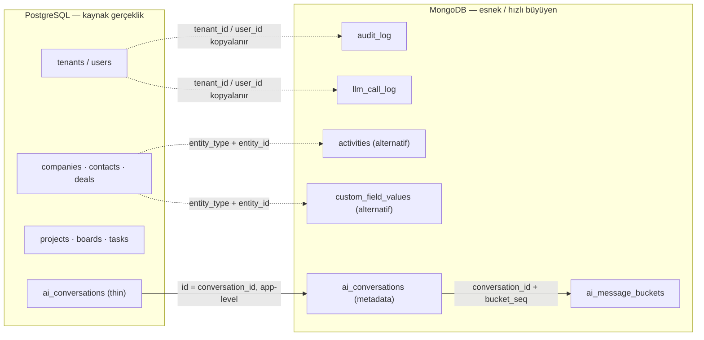

# Şema Referansı

AI-First CRM + ERP platformu iki veritabanı üzerine kurulu: çekirdek tenant/CRM/ERP verisi için **PostgreSQL**, esnek ve hızlı büyüyen AI konuşma/log verisi için **MongoDB**. Bu doküman her iki tarafın da tam şema referansını, gerekçeleriyle birlikte içerir.

**36** Postgres tablosu · **6** Mongo koleksiyonu · **4** tablo MongoDB'ye taşındı

## PostgreSQL nerede kullanılır

`tenants`, `users`, `companies`, `deals`, `projects` gibi çekirdek varlıklar — aralarında gerçek foreign key bütünlüğü, transaction garantisi ve sayısal toplama (SUM/aggregate) ihtiyacı olan her yer.

## MongoDB nerede kullanılır

AI konuşma geçmişi, audit log, tipe göre şekli değişen activity/custom field kayıtları — şema önceden tam olarak bilinmeyen, sık büyüyen, genelde tek belge halinde okunan veriler.

## Polyglot Mimari — Veri Nereye Yazılır

Düz çizgi: uygulama seviyesinde referans (id eşleşmesi). Kesik çizgi: tenant/entity kimliği yazma anında Mongo belgesine kopyalanır, DB seviyesinde FK yoktur.

:::info Yetkilendirme, Katalog ve Token Takibi — hepsi Postgres
Dinamik UI/fonksiyon kataloğu (`ui_components`, `action_registry`, `tool_registry`), RBAC (`permissions`, `role_permissions`) ve token kotası (`subscription_plans`, `tenant_token_usage`) "esnek" görünse de bilinçli olarak **Mongo'ya değil Postgres'e** kondu — gerekçe hacim değil doğruluk riski: yanlış bir katalog/izin/kota kaydı, LLM'in olmayan bir butonu göstermesi ya da bir tenant'ın kotasını yanlış hesaplaması demek. Detaylar için [Platform & Yetkilendirme](/postgres/platform/permissions) grubuna bakın.
:::

## Tip Karşılığı — Postgres ↔ MongoDB

  
PostgreSQL → MongoDB

  

    uuid
    →
    string (UUID v4 metni olarak)
  

  

    varchar(n) / text
    →
    string
  

  

    boolean
    →
    bool
  

  

    int / bigint / smallint
    →
    int / long
  

  

    numeric(p,s)
    →
    decimal128
  

  

    timestamptz
    →
    date
  

  

    jsonb (sabit yapı)
    →
    object / array — dönüşüm gerekmez
  

  

    jsonb (dinamik anahtarlar / EAV)
    →
    object + wildcard index ($**)
  

:::tip Bu Revizyonda Tamamlananlar
- RLS (Row-Level Security) için `tenant_id`, eksik olan 4 alt tabloya (`board_columns`, `project_members`, `calendar_event_attendees`, `taggables`) denormalize edildi.
- Mutasyona açık ama `updated_at`'i eksik olan tablolara (`contacts`, `tasks`, `projects`, `boards`, `calendar_events`) bu alan eklendi; hiç timestamp taşımayan `addresses`, `tags`, `pipeline_stages`, `board_columns` tablolarına `created_at` eklendi.
- `deals.probability` alanı `int` → `smallint` (0-100 CHECK) olarak daraltıldı; `tasks`'a `completed_at` eklendi.
- Her tenant-scoped tabloya en az bir `(tenant_id, …)` composite index tanımlandı.
- `audit_log` ve `ai_messages` ailesi (3 tablo) tamamen MongoDB'ye taşındı.
- MongoDB tarafına `custom_field_values` (EAV, wildcard index) eklendi — Postgres'teki `jsonb custom_fields` kolonuna merkezi alternatif olarak.
- **Yeni: "Platform & Yetkilendirme" grubu** — RBAC köprüsü (`permissions` + `role_permissions`), dinamik UI/fonksiyon/tool kataloğu (4 tablo) ve token/kota takibi (5 tablo, `models` dahil) eklendi.
- **Yeni: `llm_call_log` (Mongo)** — her mini/ana LLM çağrısının ham kaydı, tenant maliyet raporlamasının kaynağı.
- **Düzeltme: isim yerine id ile eşleştirme.** `permissions.catalog_item_name` → `catalog_item_id`; `llm_model_routing`/`model_pricing`'in ham Bedrock string'ine (`model_id` varchar) referans vermesi yerine yeni `models` kataloğuna (`model_id` uuid FK) bağlandı. İkisi de aynı sınıf hatayı çözüyor: sağlayıcı/katalog ismi değişirse referans sessizce kopmasın diye.
- **Yeni: `created_by`/`updated_by`/`deleted_at`.** 22 tabloya (bridge tablolar ve zaten eşdeğeri olanlar hariç) audit alanları, 10 çekirdek iş kaydı tablosuna (companies, contacts, deals, projects, tasks…) soft-delete eklendi.
:::

## Nereden başlamalı

- **[İlişkiler](/relationships)** — Postgres içi, Postgres↔Mongo köprüsü ve Mongo içi ilişkiler tek sayfada
- **[PostgreSQL İlişki Diyagramı](/postgres/erd)** — 36 tablonun tam ERD'si
- **[MongoDB Modelleme İlkeleri](/mongodb/principles)** — embed/reference/bucket kararları nasıl verildi
- **[Platform & Yetkilendirme](/postgres/platform/permissions)** — RBAC, dinamik UI/fonksiyon/tool kataloğu, token/kota takibi
- **[Mimari İlkeler](/architecture/security)** — Güvenlik, Maliyet, Performans, Güvenilirlik: şemaya dağılmış kararların çapraz-kesen özeti + henüz çözülmemiş açık konular
- Sol menüden Core → CRM → ERP → AI Katalog → Platform & Yetkilendirme sırasıyla Postgres tablolarını, MongoDB bölümünden de 6 koleksiyonu tek tek inceleyebilirsiniz.
