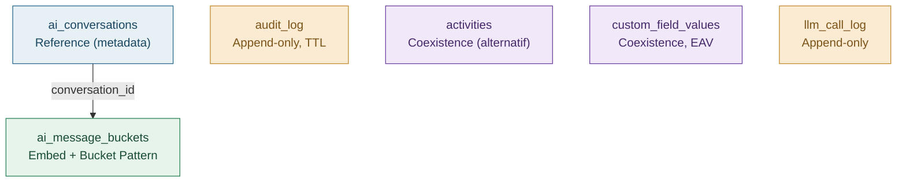

import CopyRemoteFileButton from '@site/src/components/CopyRemoteFileButton';

# MongoDB Modelleme İlkeleri

Aşağıdaki 6 koleksiyon rastgele seçilmedi — her biri şu dört soruya verilen cevaba göre şekillendi. Bir veri kümesini MongoDB'ye taşımadan/modellemeden önce bu listeyi kontrol edin.

### 01 — Embed mi, Reference mi?

Veri her zaman birlikte mi okunuyor, bağımsız sorgulanıyor mu, sınırsız mı büyüyor? Cevap "birlikte okunuyor + sınırlı büyüyor" ise embed; "bağımsız sorgulanıyor + sınırsız büyüyor" ise reference ya da bucket pattern.

### 02 — Bucket Pattern: sınırsız diziden kaçının

Bir konuşma teorik olarak binlerce mesaj içerebilir. Bunu tek belgede sınırsız bir diziye gömmek yerine, sabit üst sınırlı (≤50 mesaj) bucket'lara bölüyoruz — hem 16MB belge limitine hem de belge büyüme/taşınma maliyetine karşı.

### 03 — Şema doğrulama: zorunlu ama esnek

`$jsonSchema` validator'ları sadece kritik alanları (tenant_id, gerekli id'ler) zorunlu kılar, geri kalanını serbest bırakır. `validationLevel: moderate` ile şema zamanla evrilebilir, eski belgeler zorla yeniden doğrulanmaz.

### 04 — Shard key = tenant_id

Çok kiracılı (multi-tenant) bir sistemde en doğal shard key `tenant_id`'dir (genelde hashed). Böylece büyük/gürültülü bir tenant tüm cluster'ı yormaz, veri kiracılar arasında dengeli dağılır.

## Karar Tablosu — Embed / Reference / Bucket

| Soru | Embed | Reference / Bucket |
|---|---|---|
| Veri her zaman birlikte mi okunuyor? | Evet → embed | Hayır → reference |
| Alt veri sınırsız büyüyebilir mi? | Hayır, sınırlı → embed | Evet, sınırsız → bucket / reference |
| Alt veri bağımsız sorgulanıyor/filtreleniyor mu? | Hayır → embed | Evet → reference |
| Güncelleme sıklığı ve boyutu? | Nadiren, küçük → embed | Sık, büyük/parçalı → reference |

## Koleksiyonlara Genel Bakış

DBML/dbdiagram.io ilişkisel bir araç — MongoDB'nin doküman yapısını ifade edemiyor. Onun yerine aynı "renkli, modele göre gruplu" görseli kendi diyagramımızda veriyoruz:

| Koleksiyon | Model | Postgres ile ilişkisi |
|---|---|---|
| [ai_conversations](/mongodb/ai-conversations) | Reference (metadata) | Postgres'teki thin tabloyla id paylaşır |
| [ai_message_buckets](/mongodb/ai-message-buckets) | Embed + Bucket Pattern | Postgres'ten tamamen taşındı |
| [audit_log](/mongodb/audit-log) | Append-only, TTL | Postgres'ten tamamen taşındı |
| [activities](/mongodb/activities) | Coexistence (alternatif) | Postgres'teki `activities` ile paralel, opsiyonel |
| [custom_field_values](/mongodb/custom-field-values) | EAV, wildcard index | Postgres'teki `jsonb custom_fields`'e alternatif |
| [llm_call_log](/mongodb/llm-call-log) | Append-only | Postgres'ten tamamen taşındı |

## Gerçek Bir MongoDB'de Görüntüleme

dbdiagram.io gibi "yapıştır-gör" bir online editör MongoDB için yok — DBML ilişkisel tablo/FK diline özgü, doküman şemasını ifade edemiyor. Onun yerine gerçek MongoDB araçlarına gidiyoruz: aşağıdaki script'i kopyalayıp **MongoDB Compass**'ın (masaüstü) veya **Atlas Data Explorer**'ın (web) gömülü mongosh kabuğuna yapıştırın — 6 koleksiyonun tamamı, validasyon kurallarıyla ve örnek belgelerle birlikte gerçek bir veritabanında oluşur. Ardından Compass'ın "Schema" sekmesinde görsel olarak da inceleyebilirsiniz.

<CopyRemoteFileButton path="/mongo-seed.js" label="📋 Tüm Mongo Seed Script'ini Kopyala (6 koleksiyon)" />

:::danger Sınırlamalar / Trade-off'lar
- **Cross-database transaction yok:** Bir deal'i Postgres'te güncelleyip aynı anda Mongo'da bir activity oluşturmak tek bir atomic işlem değildir — uygulama seviyesinde retry / outbox pattern gerekir.
- **Foreign key enforcement yok:** Mongo belgelerindeki `tenant_id`, `conversation_id` gibi referanslar veritabanı seviyesinde garanti edilmez, sadece uygulama kodu ve şema validasyonu ile korunur.
- **Tenant silme akışı iki adımlı:** Postgres'te CASCADE ile ilişkili satırlar anında silinirken, Mongo tarafında bu iş arka planda bir temizlik job'ı (tenant_id'ye göre toplu silme) ile yapılmalıdır — hemen değil, eninde sonunda tutarlı (eventually consistent).
:::
