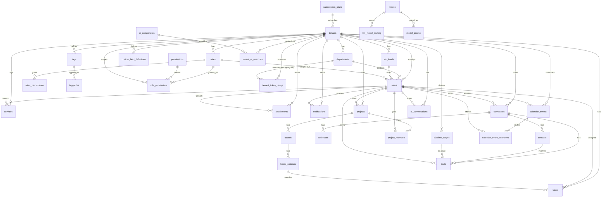

import OpenInDbdiagram from '@site/src/components/OpenInDbdiagram';

# PostgreSQL İlişki Diyagramı

36 tablonun tamamı, foreign key ilişkileriyle. Kolon detayları için sol menüdeki tablo sayfalarına bakın — bu diyagram sadece büyük resmi gösterir (created_by/updated_by gibi audit alanları ve polimorfik id referansları burada gösterilmiyor, sadeliği bozmasın diye).

Aşağıdaki statik diyagram yeterli değilse — tıklayın: içerik panoya kopyalanır, yeni sekmede dbdiagram.io açılır, orada yapıştırıp sürükle-bırak, filtrelenebilir, PNG/PDF export edilebilir bir ERD üzerinde inceleyebilirsiniz.

<OpenInDbdiagram />

:::note
`audit_log`, `ai_messages`, `ai_message_tool_calls`, `ai_message_ui_widgets` bu diyagramda yer almıyor — tamamen MongoDB'ye taşındılar. Bkz. [MongoDB](/mongodb/principles).

`permissions`, `ui_components`, `action_registry`, `tool_registry` de bu diyagramda yok — `permissions.catalog_item_id` isim değil gerçek bir id ile eşleşiyor artık, ama `catalog_type`'a göre 3 farklı tablodan birine bakabildiği için (polimorfik) tek bir sabit FK oku olarak çizilemiyor — tıpkı `activities`/`attachments`/`tasks`'teki `entity_type + entity_id` gibi. `handler_ref` (action_registry) ve `underlying_query_ref` (tool_registry) ise bilinçli olarak isim/referans kalıyor — bunlar backend fonksiyon/SQL isimleri, LLM'e hiçbir zaman gerçek bir id/URL verilmiyor (gölgeleme prensibi). Bkz. [Platform & Yetkilendirme](/postgres/platform/permissions) ve [Güvenlik & İzolasyon](/architecture/security).
:::
