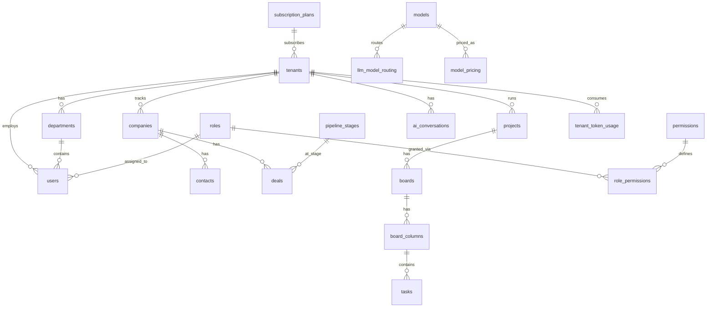
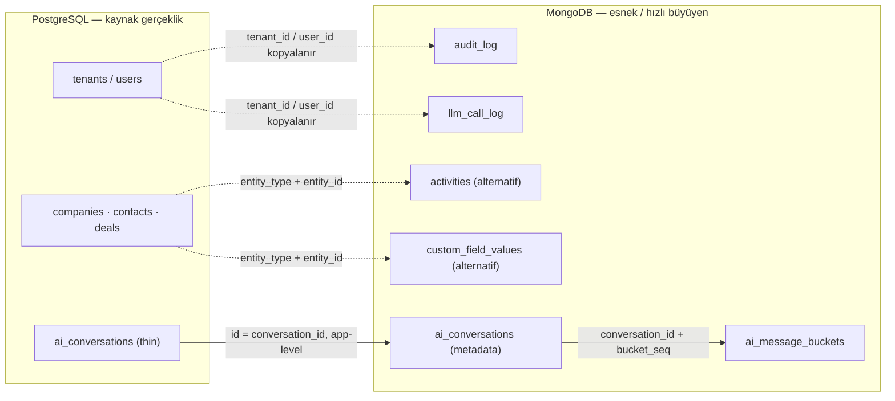
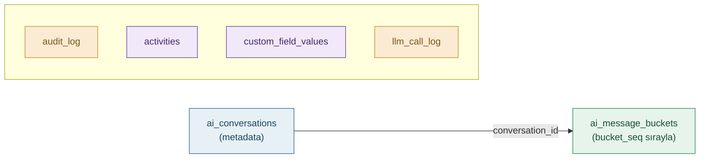

import OpenInDbdiagram from '@site/src/components/OpenInDbdiagram';
import CopyRemoteFileButton from '@site/src/components/CopyRemoteFileButton';

# İlişkiler — Postgres, Mongo ve İkisi Arasında

Şemadaki ilişki bilgisi üç ayrı yere dağılmıştı: Postgres ERD, Postgres↔Mongo köprüsü ve Mongo'nun kendi iç bağları. Bu sayfa üçünü tek yerde topluyor.

## 1. PostgreSQL İçi İlişkiler

36 tablonun tamamı, foreign key ilişkileriyle. Ayrıntılı sürüm ve DBML export için [PostgreSQL İlişki Diyagramı](/postgres/erd) sayfasına bakın.

<OpenInDbdiagram />

_Tam 95 ilişkili sürüm için [İlişki Diyagramı (ERD)](/postgres/erd) sayfasına gidin._

## 2. Postgres ↔ MongoDB Köprüsü

Düz çizgi: uygulama seviyesinde referans (id eşleşmesi). Kesik çizgi: tenant/entity kimliği yazma anında Mongo belgesine kopyalanır, DB seviyesinde FK yoktur.

:::danger Bu köprünün sınırı
Cross-database transaction ve FK enforcement yok — detaylar için [Güvenilirlik & Tutarlılık](/architecture/reliability).
:::

## 3. MongoDB İçi İlişkiler

Mongo tarafında koleksiyonların çoğu **birbirine referans vermez** — her biri bağımsız, sadece `tenant_id` ile izole olur. Tek gerçek iç ilişki, konuşma metadata'sını mesaj bucket'larına bağlayan zincir:

Alttaki 4 koleksiyon (`audit_log`, `activities`, `custom_field_values`, `llm_call_log`) kasıtlı olarak birbirinden bağımsız — her biri kendi `tenant_id`'siyle izole, aralarında JOIN'e benzer bir erişim deseni yok. Bu, sharding stratejisini de basitleştiriyor (bkz. [Performans & Ölçekleme](/architecture/performance)).

<CopyRemoteFileButton path="/mongo-seed.js" label="📋 Tüm Mongo Seed Script'ini Kopyala (6 koleksiyon)" />

## Nereye bakmalı

- Tek bir tablonun/koleksiyonun tüm alanları → sol menüden ilgili sayfa
- "Neden Postgres/Mongo" kararının gerekçesi → [Genel Bakış](/intro)
- Güvenlik, maliyet, performans, güvenilirlik açısından çapraz-kesen bakış → [Mimari İlkeler](/architecture/security)
